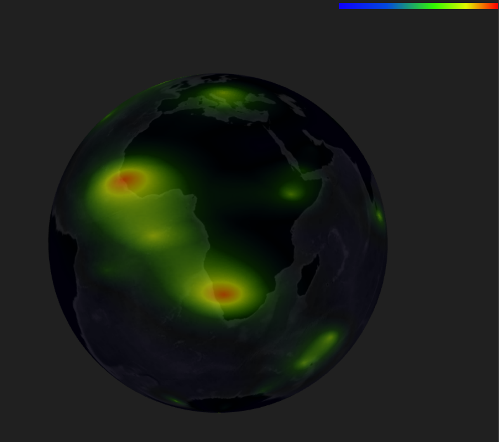

# My Global

## 酷炫3D地球 🌎

🧭 界面入口为  `global_plus.html`

### Features

- [X] 动态星空背景
- [X] 大气层光晕
- [X] 地球自转和行星环绕
- [X] 扩散光圈和涟漪特效
- [X] 光柱特效
- [X] 基于geojson的区域描边
- [X] 地点之间的飞线效果
- [X] 地理边界的流光特效

> ✅ 这里有gif动图哦，如果没有加载出来请稍等一下哦  👇

## 球面上的数据可视化 🌈

🧭 界面入口为  `global_charts.html`

* 在球面上的对带坐标的数据进行可视化；
* 采用合并mesh优化性能；
* 基于Tween.js实现数据切换的动效；

> ✅ 这里有gif动图哦，如果没有加载出来请稍等一下哦  👇

## 动态云层和地形起伏 ☁

🧭 界面入口为  `global_terrain_cloud.html`

* 在地球表面通过海拔高度高度添加法向偏移，模拟地球便面的地形起伏效果；
* 通过着色器中的颜色混合，给地球添加动态的云层效果；

> ✅ 这里有gif动图哦，如果没有加载出来请稍等一下哦  👇

## 热力图 🔥

* > ✅ 三维热力图：这里有gif动图哦，如果没有加载出来请稍等一下哦  👇
  >

🧭 界面入口为  `global_2d_heatmap.html`

* 以下是球面上的二维热力图效果：

